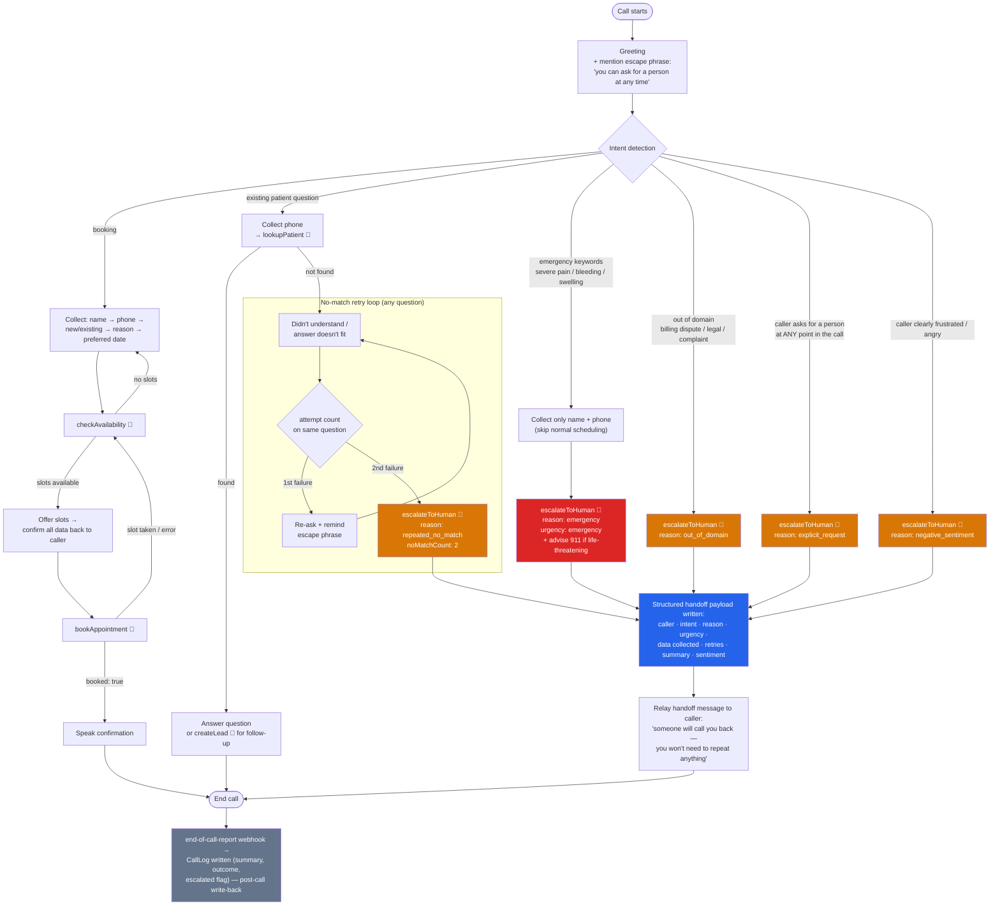

# Call flow — Brightside Dental front-desk voice agent

This diagram covers the full inbound call flow, including the no-match retry loop and every
escalation path. Escalation always goes through the `escalateToHuman` tool, which writes a
structured handoff payload to the mock CRM (`POST /vapi/tool-calls` → `Handoff` record) before
the call ends — that payload is what the human agent sees on the [dashboard](../server/public/dashboard.html).

🔧 = mid-call synchronous tool call (webhook to the backend, `POST /vapi/tool-calls`).

## Walkthrough: happy path (booking)

1. Caller: "Hi, I'd like to book a cleaning."
2. Agent collects name, phone, patient type, reason, preferred date — one question at a time.
3. Agent calls `checkAvailability` (never invents times), offers real open slots.
4. Caller picks a slot; agent confirms **all** collected data back before booking.
5. Agent calls `bookAppointment`; on `booked: true`, speaks the confirmation and ends the call.
6. After hangup, Vapi fires `end-of-call-report` → backend writes a `CallLog` (post-call
   CRM write-back: summary, outcome, call id, escalated=false).

## Walkthrough: escalated path (repeated no-match)

1. Caller answers the "preferred date" question with something unintelligible.
2. Agent: "Sorry, I didn't catch that — could you say the date again? You can also just say
   'talk to a person' at any time." *(retry 1 + escape phrase reminder)*
3. Second unintelligible answer → agent does **not** ask a third time. It calls
   `escalateToHuman` with `reason: repeated_no_match`, `noMatchCount: 2`, plus everything
   already collected (name, phone, reason for visit) and a 1-3 sentence summary written for
   the human agent.
4. Backend validates and stores the structured `Handoff`; the dashboard shows it instantly.
5. Agent tells the caller a human will call back and that **they won't need to repeat
   anything** — that promise is the entire point of the structured payload.

## Design rules encoded in this flow

| Rule | Where it lives |
|---|---|
| Max 2 retries per question, then escalate | System prompt (`assistant/system-prompt.md`) — Vapi has no native retry counter, so this is prompt-enforced (see runbook, "known limitations") |
| Low-confidence transcripts filtered before the LLM | `transcriber.confidenceThreshold: 0.4` in `assistant-config.json` |
| Escape phrase always available | Mentioned at greeting + after first failed retry |
| Emergency skips normal flow | System prompt: collect only name+phone, escalate with `urgency: emergency` |
| Handoff is structured, never free-form | `escalateToHuman` JSON schema (`assistant/tools/escalate-to-human.json`) marks `escalationReason`, `intent`, `urgency`, `transcriptSummary`, `sentiment` as **required**; backend rejects payloads without a summary |
| No invented availability / bookings | System prompt tool rules + backend guards (slot must exist and be unbooked) |
